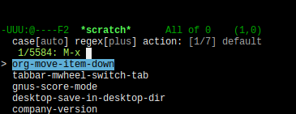
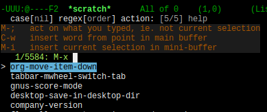

This fork of [Swiper](https://github.com/abo-abo/swiper), located
at https://github.com/Boruch-Baum/swiper, provides the
following additional features:

1) An informative interface for ivy.

1.1) Although Ivy has multiple modes of operation, multiple regex
     techniques, and multiple actions, Ivy does not give a user visual
     feedback of its current state of operation, this even though a
     user can dynamically change any of those in mid-selection. It is
     very easy to lose track.

1.2) Ivy users may also suffer confusion from the many keybindings
     for the many options that Ivy offers.

  This fork addresses both those issues. It provides a single-line
  informative display above the minibuffer, in the form: "case[%s]
  regex[%s] action: %s%s", and optionally also display usage hints,
  which can be edited according to the user's need.

  These features are toggled by evaluating function
  `ivy-lv-display-mode'. When the feature is enabled and focus is in
  an ivy minibuffer, display of hints are toggled by keybinding
  `M-?'.


---
screenshot of the interface


---

---
screenshot of a sample hint


---

# Original README begins here

[](https://travis-ci.org/abo-abo/swiper)

***flexible, simple tools for minibuffer completion in Emacs***

This repository contains:

**Ivy**, a generic completion mechanism for Emacs.

**Counsel**, a collection of Ivy-enhanced versions of common Emacs
commands.

**Swiper**, an Ivy-enhanced alternative to isearch.

# Ivy

[](http://melpa.org/#/ivy)

Ivy is a generic completion mechanism for Emacs. While it operates
similarly to other completion schemes such as `icomplete-mode`, Ivy
aims to be more efficient, smaller, simpler, and smoother to use yet
highly customizable.

To try Ivy, just call <kbd>M-x</kbd> `ivy-mode`. This will enable
generic Ivy completion, including specific completion for file and
buffer names.

### Installation

Install the `ivy` package from MELPA / GNU ELPA.

## Documentation

### Manual
The manual is available as [HTML](http://oremacs.com/swiper/).

After installing from MELPA, the manual is also available through the `(ivy)` Info node.

The source file for the Info page is
[here](https://github.com/abo-abo/swiper/blob/master/doc/ivy.org).

### Wiki
Ivy and Swiper wiki is here: [the wiki](https://github.com/abo-abo/swiper/wiki).

### Small config example
```elisp
(ivy-mode 1)
(setq ivy-use-virtual-buffers t)
(setq enable-recursive-minibuffers t)
(global-set-key "\C-s" 'swiper)
(global-set-key (kbd "C-c C-r") 'ivy-resume)
(global-set-key (kbd "<f6>") 'ivy-resume)
(global-set-key (kbd "M-x") 'counsel-M-x)
(global-set-key (kbd "C-x C-f") 'counsel-find-file)
(global-set-key (kbd "<f1> f") 'counsel-describe-function)
(global-set-key (kbd "<f1> v") 'counsel-describe-variable)
(global-set-key (kbd "<f1> l") 'counsel-find-library)
(global-set-key (kbd "<f2> i") 'counsel-info-lookup-symbol)
(global-set-key (kbd "<f2> u") 'counsel-unicode-char)
(global-set-key (kbd "C-c g") 'counsel-git)
(global-set-key (kbd "C-c j") 'counsel-git-grep)
(global-set-key (kbd "C-c k") 'counsel-ag)
(global-set-key (kbd "C-x l") 'counsel-locate)
(global-set-key (kbd "C-S-o") 'counsel-rhythmbox)
(define-key minibuffer-local-map (kbd "C-r") 'counsel-minibuffer-history)
```

# Counsel

`ivy-mode` ensures that any Emacs command using
`completing-read-function` uses ivy for completion.

Counsel takes this further, providing versions of common Emacs
commands that are customised to make the best use of ivy. For example,
`counsel-find-file` has some additional keybindings. Pressing
<kbd>DEL</kbd> will move you to the parent directory.

# Swiper

[](https://melpa.org/#/swiper)

Swiper is an alternative to isearch that uses ivy to show an overview
of all matches.


A helm version of swiper is also available:
[swiper-helm](https://github.com/abo-abo/swiper-helm).

## Screenshots


There's also a ten minute [video demo](https://www.youtube.com/watch?v=VvnJQpTFVDc).

# Frequently asked questions

Q: How do I enter an input that matches one of the candidates instead
   of this candidate? Example: create a file `bar` when a file
   `barricade` exists in the current directory.

A: Press <kbd>C-M-j</kbd>. Alternatively, you can make the prompt line selectable with `(setq ivy-use-selectable-prompt t)`.

# Contributing

Please see the [guidelines](https://github.com/abo-abo/swiper/blob/master/CONTRIBUTING.org) for reporting issues and opening pull requests.
